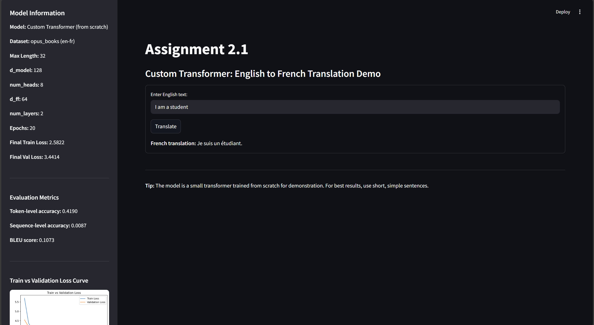

# KU AICL434 (LLM Assignment 2)

## English-to-French Transformer Translator

This project implements a custom Transformer model (from scratch) for English-to-French translation, trained on the [opus_books](https://huggingface.co/datasets/opus_books) dataset. The app provides an interactive Streamlit demo for translation and visualizes training progress and evaluation metrics.

---

## Features

- Custom Transformer architecture (no high-level libraries)
- English-to-French translation demo (Streamlit)
- Training and validation loss curves
- Evaluation metrics: Token-level accuracy, Sequence-level accuracy, BLEU score
- Git LFS support for large model files

---

## Getting Started

### 1. Clone the repository

```bash
git clone https://github.com/yourusername/your-repo.git
cd your-repo
```

### 2. Install dependencies

```bash
pip install -r requirements.txt
```

### 3. Download NLTK data (if running evaluation)

```bash
python -c "import nltk; nltk.download('punkt')"
```

### 4. Run the Streamlit app

```bash
streamlit run app.py
```

---

## File Structure

- `app.py` — Streamlit app for translation and visualization
- `eval.py` — Evaluation script for model metrics
- `scratch_transformer.py` — Custom Transformer implementation
- `requirements.txt` — Python dependencies
- `best_model.pt` — Trained model weights (tracked with Git LFS)
- `train_losses.npy`, `val_losses.npy` — Training/validation loss history
- `eval_metrics.json` — Evaluation results
- `loss_curve.png` — Training/validation loss plot
- `.gitignore`, `.gitattributes` — Git and Git LFS configuration

---

## Model Weights & Large Files

Model weights (`*.pt`, `*.npy`) are tracked with [Git LFS](https://git-lfs.github.com/).  
If you clone the repo, make sure you have Git LFS installed:

```bash
git lfs install
git lfs pull
```

---

## Demo



---

## Example Usage

1. Enter an English sentence in the app.
2. Click "Translate" or press Enter.
3. View the French translation and evaluation metrics.
